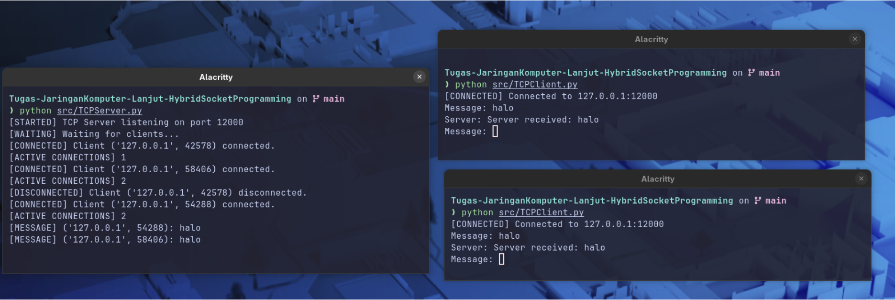
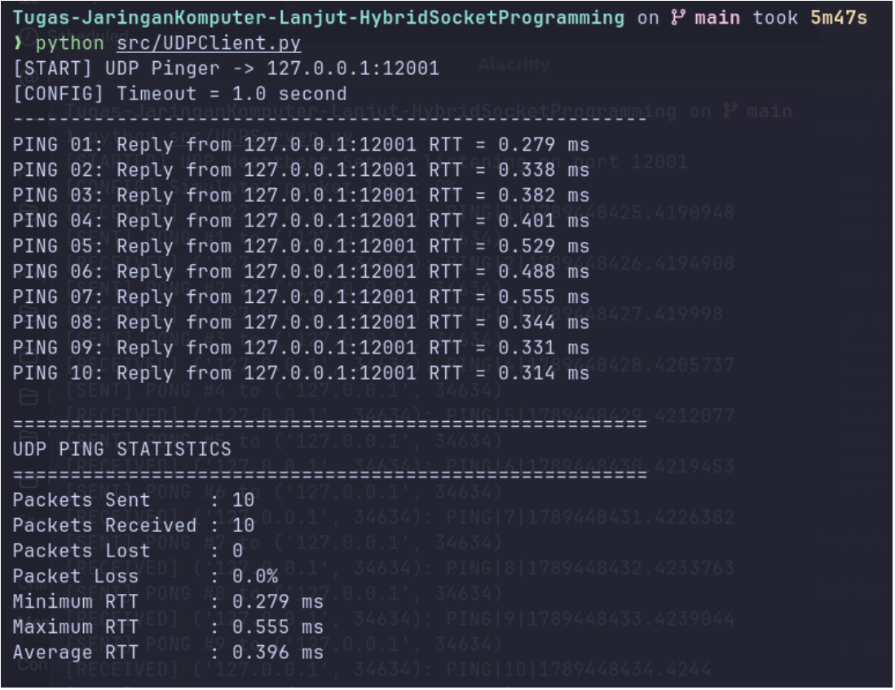
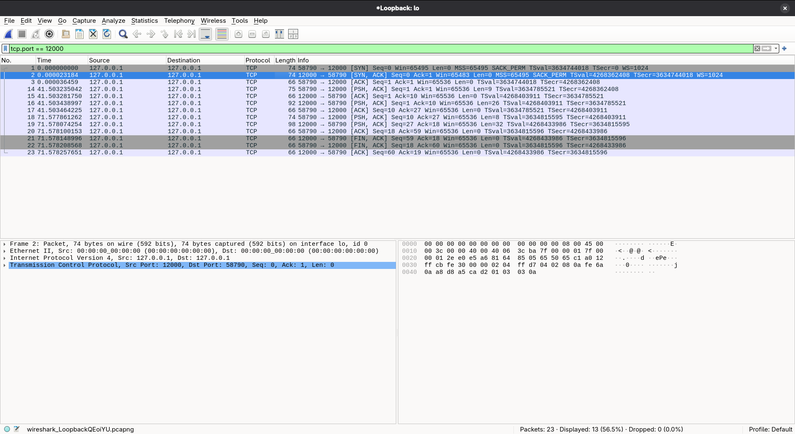
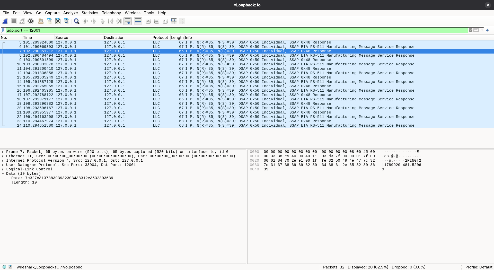

# LAPORAN TUGAS JARINGAN KOMPUTER LANJUT
## Pengembangan dan Analisis Sistem Distribusi Pesan & File Berbasis Hybrid Socket

**Nama:** Alif Ilman Nafian  
**NIM:** 25/572957/PPA/07203  
**Program Studi:** Magister Ilmu Komputer  
**Mata Kuliah:** Jaringan Komputer Lanjut  

---

## 1. Pendahuluan

Pada tugas ini dikembangkan aplikasi **client-server berbasis Python 3** yang menggabungkan dua mekanisme komunikasi, yaitu **TCP** untuk layanan pertukaran pesan dan **UDP** untuk layanan heartbeat/pinger. TCP server dirancang untuk menangani beberapa client secara bersamaan menggunakan `threading`, sedangkan UDP digunakan untuk mengukur **Round Trip Time (RTT)** serta mendeteksi **packet loss** melalui mekanisme timeout.

Implementasi menggunakan:

- **TCP server:** `127.0.0.1:12000`
- **UDP server:** `127.0.0.1:12001`
- **TCP message framing:** header panjang pesan 4 byte
- **UDP timeout:** 1 detik
- **Jumlah UDP ping:** 10 kali

Arsitektur sistem:

```text
TCP Client 1 ──┐
TCP Client 2 ──┼──► TCP Server :12000
TCP Client N ──┘     Multi-threaded

UDP Client ─────────► UDP Server :12001
                      Heartbeat / Pinger
```

---

# 2. Bagian A — Implementasi Pemrograman Soket

## 2.1 Layanan TCP Multi-Client

TCP server menggunakan `AF_INET` dan `SOCK_STREAM`. Satu **welcoming socket** dibuat dan di-bind ke port `12000`, kemudian server menunggu koneksi menggunakan `listen()` dan `accept()`.

```python
server_socket = socket.socket(
    socket.AF_INET,
    socket.SOCK_STREAM
)

server_socket.bind((HOST, PORT))
server_socket.listen()
```

Setiap kali `accept()` menerima koneksi, sistem menghasilkan sebuah **connection socket** baru.

```python
connection_socket, client_address = (
    server_socket.accept()
)
```

Connection socket tersebut kemudian diberikan kepada thread baru sehingga beberapa client dapat dilayani secara bersamaan.

```python
client_thread = threading.Thread(
    target=handle_client,
    args=(connection_socket, client_address),
    daemon=True
)

client_thread.start()
```

### Lifecycle Socket TCP

**Welcoming socket (`server_socket`)**

```text
socket() → bind() → listen() → accept() → ... → close()
```

Socket ini dibuat sekali dan tetap aktif selama server berjalan. Fungsinya adalah menerima permintaan koneksi baru.

**Connection socket (`connection_socket`)**

```text
accept() → recv()/send() → ... → close()
```

Socket ini hanya digunakan untuk komunikasi dengan satu client tertentu dan ditutup setelah sesi client selesai.

Jika terdapat `N` client aktif, server memiliki:

```text
1 welcoming socket + N connection socket
```

### Message Framing

TCP merupakan **byte-stream protocol** dan tidak mempertahankan batas pesan. Oleh karena itu aplikasi menggunakan **4-byte length prefix** sebelum payload:

```python
header = struct.pack("!I", len(message_bytes))
sock.sendall(header + message_bytes)
```

Receiver membaca 4 byte header terlebih dahulu, kemudian membaca payload sebanyak panjang yang tercantum pada header. Dengan cara ini, beberapa pesan yang dikirim berurutan tetap dapat dipisahkan dengan benar.

### Hasil Pengujian TCP Multi-Client

Pengujian menunjukkan TCP server dapat menerima beberapa koneksi client secara bersamaan. Pada capture terminal, server menerima koneksi dari beberapa ephemeral port, antara lain `42578`, `58406`, dan `54288`. Server juga menampilkan `ACTIVE CONNECTIONS` hingga nilai `2`, dan dua client aktif dapat mengirim pesan `"halo"` secara independen.

<p align="center">
  
</p>

<p align="center"><em>Gambar 1. Pengujian TCP multi-client dengan dua client aktif secara bersamaan.</em></p>

Hasil tersebut menunjukkan bahwa mekanisme `accept()` dan thread per client bekerja sesuai rancangan. Putusnya satu client juga tidak menghentikan server maupun koneksi client lain.

---

## 2.2 Layanan UDP Pinger

UDP client menggunakan `AF_INET` dan `SOCK_DGRAM`. Karena UDP tidak menjamin paket sampai, client menerapkan timeout satu detik:

```python
client_socket = socket.socket(
    socket.AF_INET,
    socket.SOCK_DGRAM
)

client_socket.settimeout(1.0)
```

RTT dihitung dengan mencatat waktu tepat sebelum PING dikirim dan sesaat setelah PONG diterima.

```python
start_time = time.perf_counter()

client_socket.sendto(
    message.encode("utf-8"),
    (SERVER_HOST, SERVER_PORT)
)

response, server_address = (
    client_socket.recvfrom(BUFFER_SIZE)
)

end_time = time.perf_counter()
rtt = (end_time - start_time) * 1000
```

Apabila respons tidak diterima dalam satu detik, `socket.timeout` terjadi dan paket dianggap hilang.

### Hasil Aktual Pengujian UDP

Pengujian 10 kali PING menghasilkan:

| Parameter | Hasil |
|---|---:|
| Packets Sent | 10 |
| Packets Received | 10 |
| Packets Lost | 0 |
| Packet Loss | 0.0% |
| Minimum RTT | 0.279 ms |
| Maximum RTT | 0.555 ms |
| Average RTT | 0.376 ms |

<p align="center">
  
</p>

<p align="center"><em>Gambar 2. Hasil aktual pengujian UDP Pinger sebanyak 10 kali pengiriman.</em></p>

Pada pengujian localhost ini seluruh paket memperoleh respons sehingga packet loss bernilai `0.0%`. Nilai RTT sangat kecil karena client dan server berjalan pada host yang sama melalui interface loopback.

---

# 3. Bagian B — Analisis Mendalam dan Arsitektur Jaringan

## 3.1 Byte-Stream vs Message Boundary

TCP menggunakan `SOCK_STREAM` dan memperlakukan data sebagai **aliran byte kontinu**. TCP tidak mempertahankan batas dari setiap pemanggilan `send()`. Misalnya:

```python
send(b"Hello")
send(b"Computer")
send(b"Network")
```

tidak menjamin server akan melakukan tiga kali `recv()` dengan tiga pesan utuh. Data dapat diterima sebagai:

```text
HelloComputerNetwork
```

atau terfragmentasi menjadi beberapa bagian.

Sebaliknya, UDP menggunakan `SOCK_DGRAM` dan mempertahankan **message boundary**. Satu pemanggilan `sendto()` menghasilkan satu datagram yang diterima melalui satu `recvfrom()`. Akan tetapi, UDP tidak menjamin datagram akan sampai, tiba secara berurutan, atau bebas duplikasi.

Karena TCP tidak mempunyai batas pesan, implementasi menggunakan **application-layer framing**:

```text
┌──────────────────┬─────────────────────────┐
│ 4-byte Length    │ Message Payload         │
└──────────────────┴─────────────────────────┘
```

Receiver terlebih dahulu membaca header 4 byte untuk memperoleh panjang payload, kemudian membaca tepat sejumlah byte tersebut. Dengan demikian batas pesan ditentukan oleh protokol aplikasi, bukan oleh hasil satu pemanggilan `recv()`.

---

## 3.2 Analisis Skalabilitas Socket

Pada TCP server terdapat satu **welcoming socket** dan satu **connection socket** untuk setiap client aktif. Dengan `N` client:

```text
Total socket TCP server = N + 1
```

Sebagai contoh, 100 client aktif membutuhkan 101 socket pada proses server.

Setiap koneksi TCP dibedakan oleh **four-tuple**:

```text
(source IP, source port, destination IP, destination port)
```

Selain file descriptor, setiap koneksi TCP membutuhkan state seperti buffer, sequence number, acknowledgment, retransmission, dan congestion-control state.

UDP berbeda karena connectionless. Satu socket UDP yang di-bind pada port `12001` dapat menerima datagram dari banyak client:

```python
data, client_address = (
    server_socket.recvfrom(1024)
)
```

`recvfrom()` mengembalikan payload sekaligus alamat pengirim. Server kemudian membalas menggunakan:

```python
server_socket.sendto(
    response,
    client_address
)
```

Karena tidak membutuhkan connection socket per client, server UDP secara umum cukup menggunakan **satu socket** untuk melayani banyak client pada endpoint yang sama. Hal ini mengurangi kebutuhan file descriptor dan connection state pada sistem operasi, walaupun reliability atau session tracking tambahan harus ditangani aplikasi jika diperlukan.

---

## 3.3 Evolusi Transport dan QUIC

HTTP/3 berjalan di atas **QUIC**, sedangkan QUIC berjalan di atas UDP:

```text
HTTP/3
  ↓
QUIC
  ↓
UDP
  ↓
IP
```

Salah satu alasan utama QUIC menggunakan UDP adalah **deployability**. Jika dibuat sebagai protokol transport baru langsung di atas IP, implementasinya memerlukan dukungan baru dari sistem operasi, firewall, NAT, dan berbagai middlebox. UDP telah didukung luas sehingga QUIC dapat diimplementasikan di **user space** dan diperbarui tanpa menunggu perubahan kernel.

Walaupun menggunakan UDP sebagai substrate, QUIC mengimplementasikan sendiri berbagai fungsi transport, antara lain reliability, acknowledgment, retransmission, congestion control, connection management, multiplexing stream, dan security.

QUIC tidak menggunakan TCP sebagai dasar karena TCP menyajikan satu **ordered byte stream**. Jika sebuah segment hilang, data sesudahnya tidak dapat diberikan kepada aplikasi hingga segment yang hilang diterima kembali. Kondisi ini merupakan **Head-of-Line (HOL) Blocking**.

QUIC mengurangi masalah tersebut dengan menyediakan beberapa stream independen:

```text
QUIC Connection
 ├── Stream 1
 ├── Stream 2
 ├── Stream 3
 └── Stream 4
```

Kehilangan data pada satu stream tidak harus memblokir stream lain yang datanya sudah lengkap. HOL blocking masih dapat terjadi **di dalam stream yang sama**, tetapi tidak harus menahan seluruh stream lain pada koneksi QUIC.

---

## 3.4 Skenario Explicit Bind pada UDP Client

Secara normal client UDP tidak perlu melakukan `bind()` secara eksplisit. Sistem operasi memilih **ephemeral port** secara otomatis ketika paket dikirim.

Jika client menambahkan:

```python
client_socket.bind(("", 5432))
```

maka source port client dipaksa menjadi `5432`. Server tetap dapat membalas karena `recvfrom()` memberikan alamat IP dan port pengirim. Response dapat dikirim kembali menggunakan:

```python
server_socket.sendto(
    response,
    client_address
)
```

Masalah terjadi jika dua instance client pada host yang sama mencoba menggunakan:

```python
bind(("", 5432))
```

secara bersamaan. Dalam kondisi normal, instance kedua gagal melakukan bind karena address/port tersebut sudah digunakan dan dapat menghasilkan error seperti:

```text
OSError: [Errno 98] Address already in use
```

Karena itu client pada umumnya membiarkan sistem operasi memilih ephemeral port sehingga beberapa instance dapat berjalan bersamaan tanpa konflik port lokal.

---

# 4. Analisis Paket Menggunakan Wireshark

## 4.1 Capture TCP

Capture dilakukan pada interface loopback `lo` menggunakan display filter:

```text
tcp.port == 12000
```

<p align="center">
  
</p>

<p align="center"><em>Gambar 3. Capture komunikasi TCP pada port 12000.</em></p>

Pada capture terlihat **TCP three-way handshake**:

1. Client dengan ephemeral port `58790` mengirim `SYN` ke port `12000`.
2. Server port `12000` membalas `SYN, ACK`.
3. Client mengirim `ACK`.

Setelah koneksi terbentuk, terlihat packet dengan flag `PSH, ACK` yang membawa data aplikasi antara client dan server. Pada bagian akhir capture juga terlihat `FIN, ACK` dan `ACK` yang menunjukkan proses terminasi koneksi.

Capture ini memperlihatkan karakteristik TCP sebagai protokol connection-oriented: koneksi harus dibentuk terlebih dahulu sebelum komunikasi data dan kemudian diterminasi ketika sesi selesai.

---

## 4.2 Capture UDP

Capture UDP dilakukan pada interface loopback `lo` menggunakan display filter:

```text
udp.port == 12001
```

<p align="center">
  
</p>

<p align="center"><em>Gambar 4. Capture komunikasi UDP heartbeat pada port 12001.</em></p>

Detail paket memperlihatkan **User Datagram Protocol** dengan contoh:

```text
Source Port      : 33904
Destination Port : 12001
```

Payload pada packet data juga dapat dibaca sebagai:

```text
PING|2|...
```

Hal ini menunjukkan bahwa UDP client mengirim PING langsung menuju UDP server tanpa proses three-way handshake. Server kemudian mengirim PONG kembali menuju ephemeral port milik client.

Berbeda dengan TCP, komunikasi UDP tidak mempunyai tahap pembentukan maupun terminasi koneksi. Setiap PING dan PONG merupakan datagram independen.

---

# 5. Kesimpulan

Implementasi hybrid socket menunjukkan perbedaan fundamental TCP dan UDP. TCP menyediakan komunikasi reliable dan connection-oriented, tetapi bekerja sebagai byte stream sehingga aplikasi memerlukan mekanisme framing untuk menentukan batas pesan. Untuk melayani banyak client secara bersamaan, TCP server menggunakan satu welcoming socket dan connection socket serta thread tersendiri untuk setiap client.

UDP lebih sederhana karena bersifat connectionless dan mempertahankan batas datagram. Satu socket UDP dapat melayani banyak client, sementara mekanisme timeout pada sisi client digunakan untuk mendeteksi paket yang tidak memperoleh respons. Pada eksperimen aktual, 10 PING berhasil seluruhnya dengan packet loss `0.0%`, minimum RTT `0.279 ms`, maksimum RTT `0.555 ms`, dan rata-rata RTT `0.376 ms`.

Hasil capture Wireshark mengonfirmasi perbedaan kedua transport protocol. TCP menunjukkan proses three-way handshake, pertukaran data, dan terminasi koneksi. UDP menunjukkan pengiriman datagram PING/PONG secara langsung tanpa connection establishment. Analisis QUIC menunjukkan bahwa UDP juga dapat digunakan sebagai substrate protokol transport modern untuk menyediakan multiplexing stream dan mengurangi Head-of-Line Blocking antar-stream.

---

# Referensi

Kurose, J. F., & Ross, K. W. **Computer Networking: A Top-Down Approach**, 9th Edition. Pearson.

Repository source code:

`https://github.com/man-droid23/Tugas-JaringanKomputer-Lanjut-HybridSocketProgramming`
